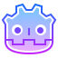

<h2 align="center">🎵 Swiji 🎵</h2>

<strong>Algerian Composer & Sound Designer</strong>

  
  
  
  
  
  

---

<h2 align="center">📖 About Me</h2>

  Huge fan of <strong>open-source software</strong>, <strong>privacy-first tools</strong>, and <strong>customizable UI themes</strong>. 
  I enjoy creating sounds that tell stories — from dark atmospheres to playful soundscapes — 
  always aiming to enhance the player’s emotional experience.

---

## 📊 GitHub Activity

  
  

---

## 🧠 Languages & Tools

  
  
  
  
  

